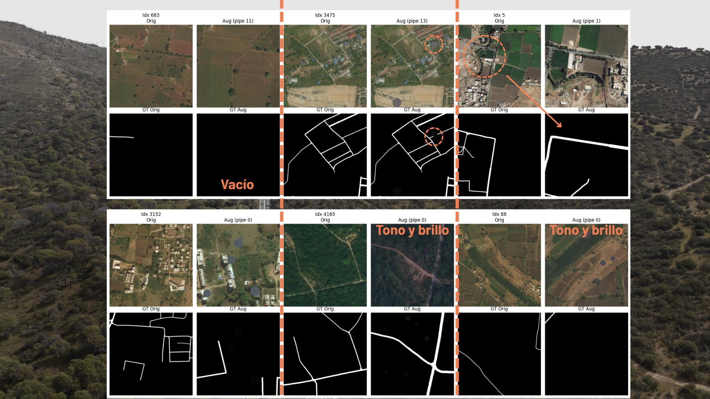
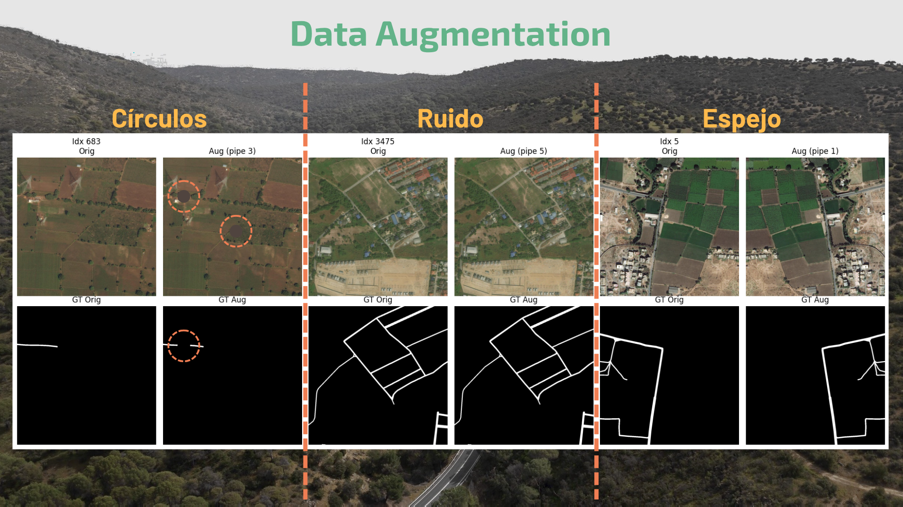
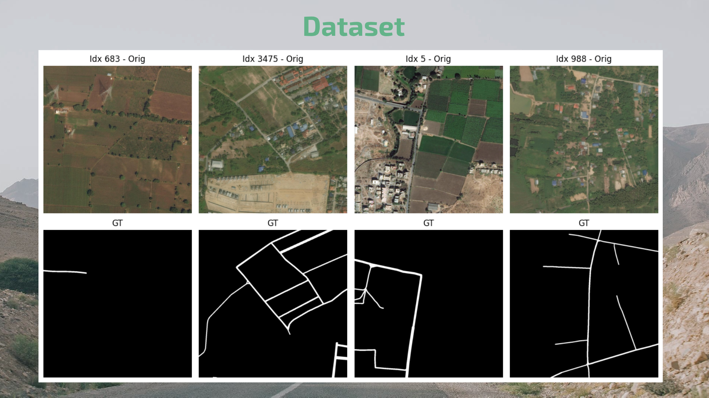
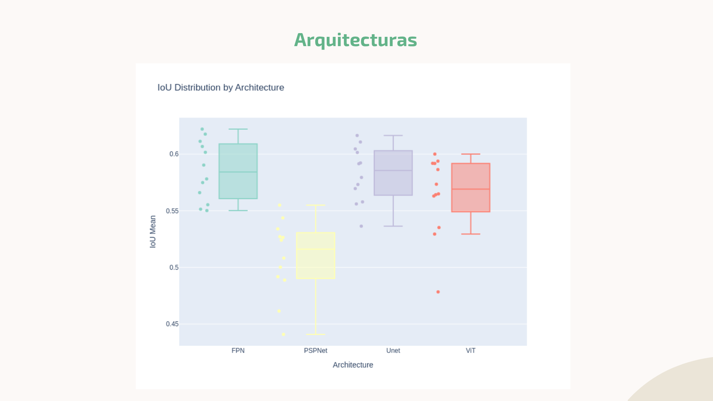
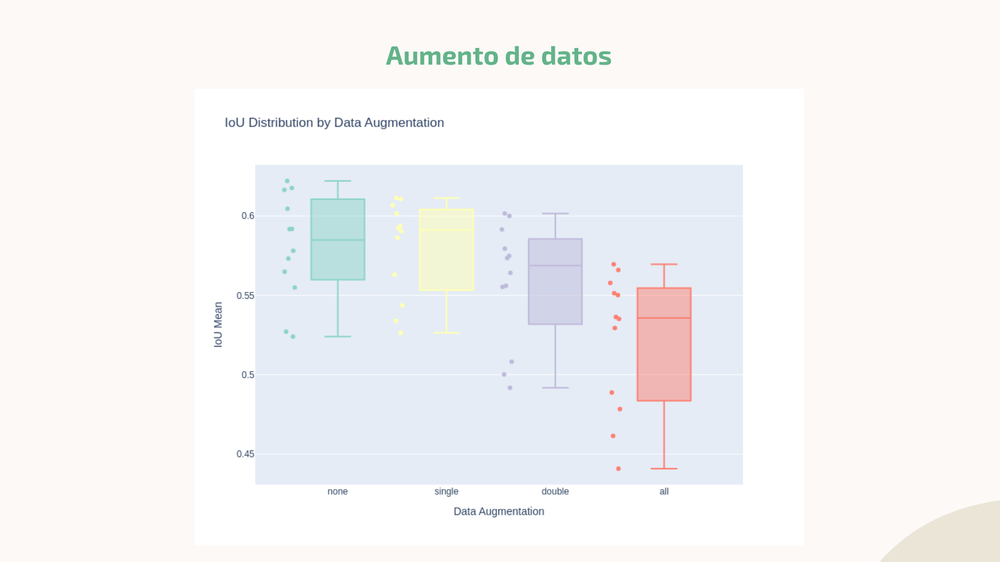
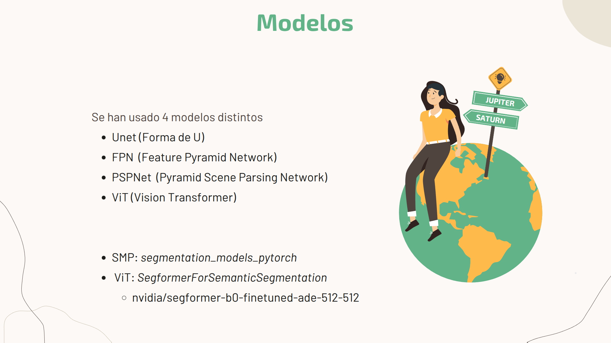
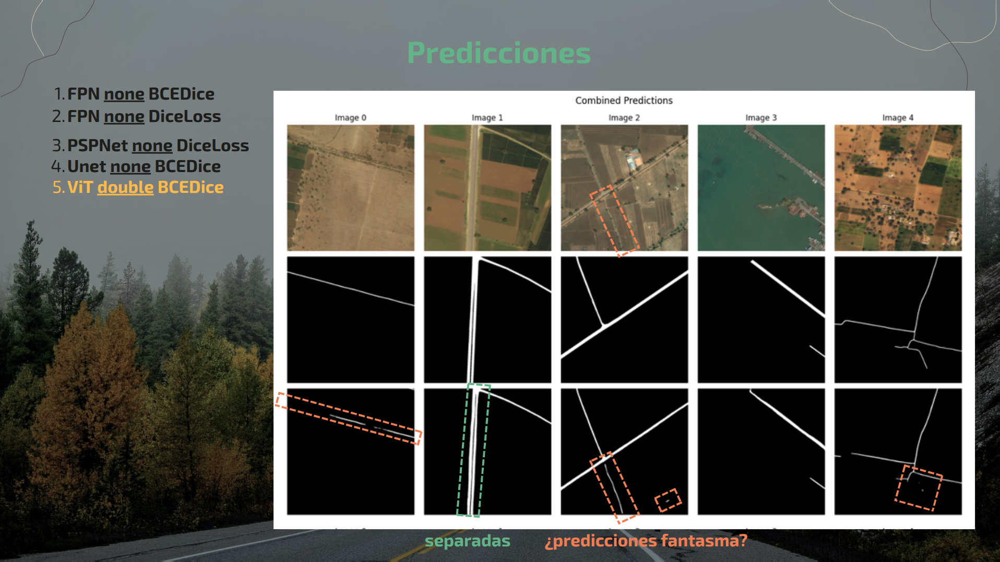
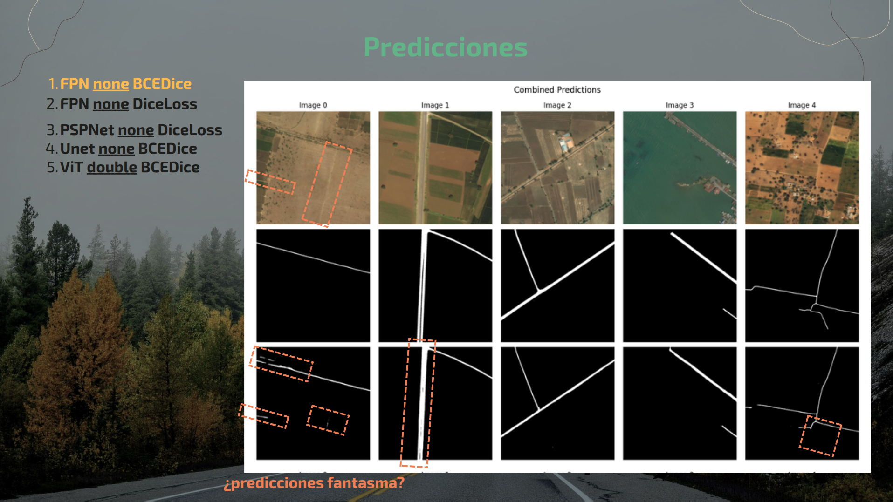

# DeepGlobe-Road-Extraction

RFA Proyect for DeepGlobe-Road-Extraction

**ALL THE REPORT FOR THE PROJECT CAN BE FOUND AT** [THIS NOTEBOOK](./notebooks/RFA_Memoría_Proyecto.ipynb)
Please if you are my teacher or someone not planning to run the code, go straight to this source. Thank you very much :p

Futher explanation of the Dataset useage, models and other topics can be found there. Below jsut technical stuff to run the code

# Dataset source

- link here [DeepGlobe Road Extraction Dataset](https://www.kaggle.com/datasets/balraj98/deepglobe-road-extraction-dataset)

# Main model libraries and sources.
- `road_segmentation_model` from [segmentation_models_pytorch](https://segmentation-modelspytorch.readthedocs.io/en/latest/).
- `road_segmentation_model_vit` from [transformers](https://huggingface.co/docs/transformers/model_doc/segformer) from Hugging Face.
  - More precisely: [nvidia/segformer-b0-finetuned-ade-512-512](https://huggingface.co/nvidia/segformer-b0-finetuned-ade-512-512)
# Use project

### Create local env

```bash
 python3.12 -m venv venv
 source venv/bin/activate


 # install requirements
 pip install uv
 uv pip install -r requirements.txt

 # install module
 uv pip install -e app/

# For notebooks
pip install ipykernel
python -m ipykernel install --user --name=venv --display-name "Python (venv)"

# Pre-commit
sudo apt install pre-commit
pre-commit install
```

### Use scripts

The application has ==XXX== scripts. All of them are accessed through main.py. You just need to specify which one you want to use along with its respective arguments.

```bash
cd app

python main.py generate-dataset
python main.py train-model -?
python main.py test-model -?
```

To consult help, it is done at two levels: general level and script level.

- General level: to see which scripts are available: `python main.py -h`

```bash
usage: app [-h] [--seed SEED] {quality-report,process-data,train-model,test} ...

Main Application CLI

positional arguments:
  {quality-report,process-data,train-model,test}
    generate-dataset    Generate dataset.
    train-model         Train model.
    test-model          Test model.
options:
  -h, --help            show this help message and exit
```

- Script level: to see the arguments of a specific script: `python main.py quality-report -h`

```bash
usage: app generate-dataset [-h]

options:
  -h, --help  show this help message and exit
    ...

```bash
```

---

<!-- portfolio-gallery:start -->
## Gallery

<p align="center">
  
  
  
  
  
  
  
  
  
</p>
<!-- portfolio-gallery:end -->
